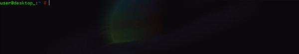

<a href="https://github.com/RamiresOliv">  </a>
<i>"Ramires"</i><br>
<p align="left">Meu nome é Gabriel, um programador focado em backend, viciado em café, e gosto de usar principalmente <a href="https://developer.mozilla.org/docs/conflicting/Web/JavaScript"></a>, <a href="https://www.lua.org/"></a> e <a href="https://www.python.org/"></a>. Não tenho muitos projetos sérios, mas se quiser dar uma olhada nas minhas criações, sinta-se à vontade.
Atualmente um dos meus maiores focos é a minha própria linguagem de programação feita em lua (luau), apelidada de <a href="https://ramiresoliv.github.io/Cobalt">Cobalt</a>.
</p>

---

<font align="left">
<h4>Projetos Principais:</h4>
<a href="https://github.com/RamiresOliv/cobalt">cobalt language</a>
<br>
<a href="https://github.com/RamiresOliv/local_db_express">npm: local-db-express</a>
<br>
</font>

---

```clojure
(print "Hello World, I am Cobalt.")
```

<br>
<a href="https://ramiresoliv.github.io/Cobalt">  </a>
<br><br>

> <i>Inspiração para esse layout: <a href="https://github.com/ArthurFt">ArthurFt</a>.</i>
