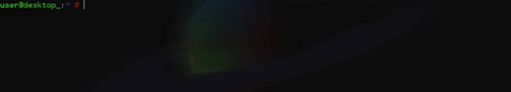

<a href="https://www.lua.org/">  </a>
<i>"Ramires:"</i><br>
<p align="left">Meu nome é Gabriel, um programador mais focado em backend, gosto de usar principalmente JS, Lua, Py.
Não tenho muitos projetos sérios, se quiser dar uma olhada nas minhas criações, sinta-se à vontade.
Atualmente um dos meus maiores focos é a minha própria linguagem de programação feita em lua (luau), apelidada de <a href="https://github.com/RamiresOliv/RubberScript"><b>RubberScript</b></a> ou (Rubber)</p>

---

<font align="left">
<h4>Projetos Principais:</h4>
- <a href="https://github.com/RamiresOliv/RubberScript">OzoneOS: rubber-script</a>
<br>
- <a href="https://github.com/RamiresOliv/local_db_express">npm: local-db-express</a>
<br>
</font>

---

```clojure
(print (str Hello World, here is Rubber! <3))
```

<br>
<a href="https://www.lua.org/">  </a>
